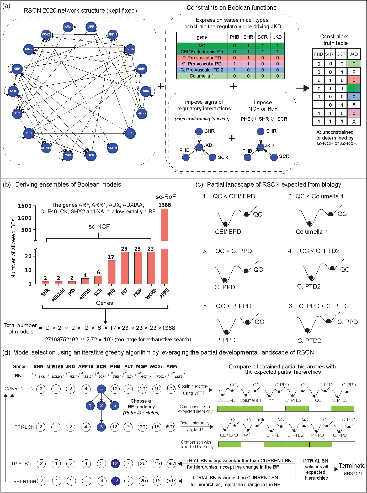

### File description
* BF_properties: computes differernt properties of Boolean functions. (file derived from https://github.com/asamallab/MCBF)
* BF_checkers: checks whether a given BF satisfies biologically meaningful properties.  (file derived from https://github.com/asamallab/MCBF)
* ModelSelectionCodes.ipynb: A jupyter notebook containing all the codes necessary to reporduce all the results of this manuscript

## CITATION
A. Subbaroyan, P. Sil, O. C. Martin, and A. Samal. Leveraging developmental landscapes for model selection in Boolean gene regulatory networks. 
Briefings in Bioinformatics, 24(3):bbad160, 2023
